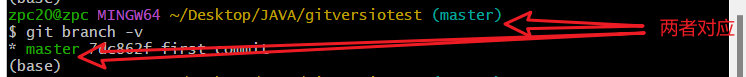

# Git分支

- **目录**

### 1.查看分支

```bash
git branch -v
```



### 2.创建分支

```bash
git branch 分支名
```


### 3.切换分支

```bash
git checkout 分支名
```


### 4.合并分支

```bash
git merge 欲合并分支
```


### 5.合并（冲突）分支


**手动打开冲突文件修改冲突**


```bash
#修改好冲突文件后加入暂存区
git add 冲突文件
git commit -m "<日志>"
```


## 6.本地分支同步到github

> **场景**:
> 
> 
> 有时候我们开发需要开一个分支,这样可以有效的并行开发.
> 
> 开分支有两种方式:
> 
> - 一种是在远程开好分支,本地直接拉下来;
> - 一种是本地开好分支,推送到远程.

### 1.****远程先开好分支然后拉到本地****

```bash
git fetch origin # 同步远程分支
git checkout -b 本地分支 origin/远程分支名 # 关联远程分支
```


### 2.****本地先开好分支然后推送到远程****

```bash
git checkout -b 分支名
git push origin 新建分支名:同步到远程的分支名
```


### 3.****git pull拉取远程分支到本地****

```bash
git pull <远程主机名> <远程分支名>:<本地分支名>
```


## 7.删除远程分支

```bash
git push origin --delete Chapater6 可以删除远程分支Chapater6 （好像也可以用 git push origin -D Chapater6）
```


## 8.****查看远程分支****

```bash
git branch -a
```


## 9.删除本地分支

```bash
git branch -d 分支名
```

